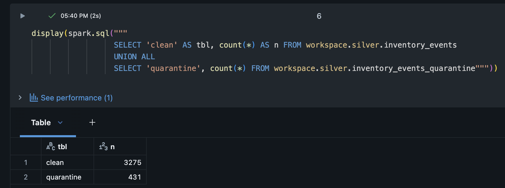
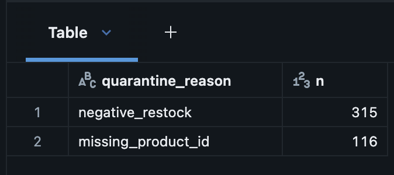
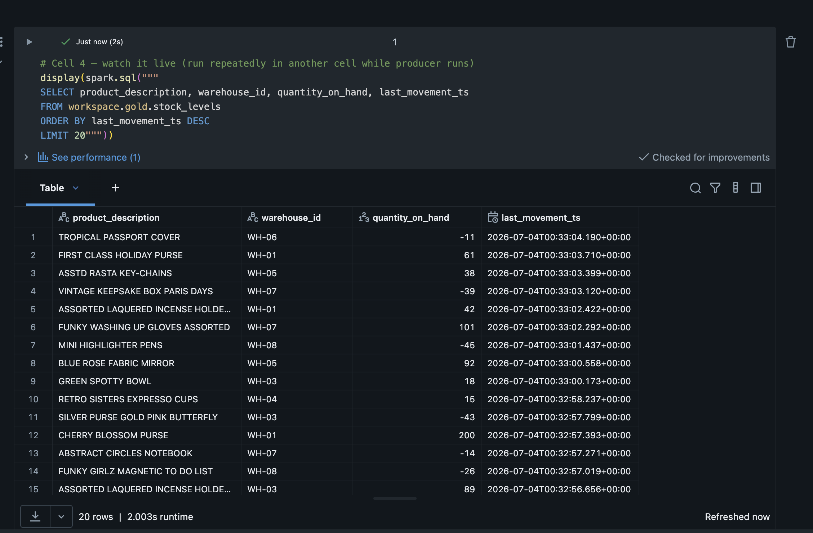
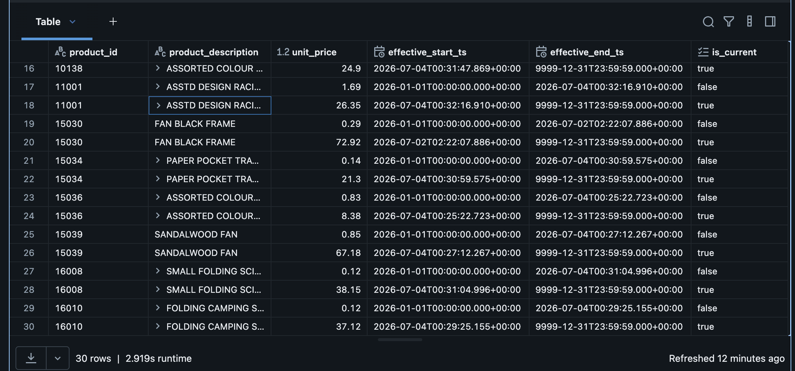
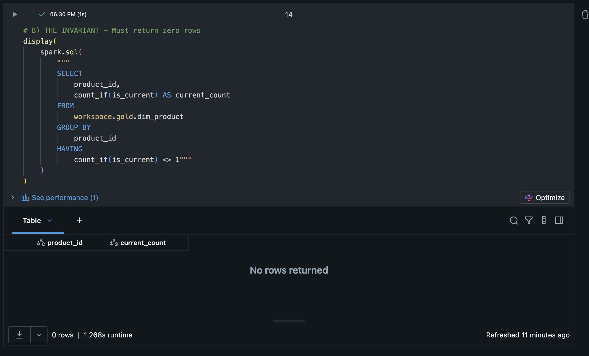

# Real-Time Inventory Lakehouse

Streaming pipeline: Python producer → Kafka (Confluent Cloud) → Spark
Structured Streaming → Delta Lake (Bronze/Silver/Gold) on Databricks.

Dimensions are seeded from the real **Online Retail II** dataset (~1M UK
e-commerce transactions). The event stream is simulated against those real
products. It includes deliberately malformed and late-arriving events to
test the data quality layer.

## Architecture

```
Python event producer (simulated ERP)
        ↓
Kafka — Confluent Cloud  (topic: inventory-events, 3 partitions)
        ↓
Spark Structured Streaming (Databricks)
        ↓
Bronze → Silver → Gold Delta tables
        ↓
dbt tests · Power BI
```

## Event types

| Event              | Share | Purpose                                  |
|--------------------|-------|------------------------------------------|
| inventory_movement | ~70%  | SALE / RESTOCK / RETURN / TRANSFER / ADJUSTMENT |
| price_update       | ~20%  | Drives SCD Type 2 history in dim_product |
| malformed / late   | ~10%  | Missing keys, invalid quantities, 2-hour-late timestamps — caught by the quality layer |

## Progress

- [x] Reference data prep: cleaned Online Retail II → 300 products, 8 warehouses (`producer/prep_reference_data.py`)
- [x] Kafka producer streaming real-product events to Confluent Cloud
- [x] Structured Streaming ingestion → Bronze Delta (exactly-once verified: 3706/3706, 0 duplicates)
- [x] Silver: validation, deduplication, quarantine (reconciled: 3,275 clean + 431 quarantined = 3,706)
- [x] Gold: streaming stock aggregate + SCD Type 2 dim_product (589 rows, 300 products, invariant holds)
- [ ] Terraform: Azure infra (ADLS, Key Vault, Databricks)
- [ ] dbt tests + freshness alerting
- [ ] CI/CD: GitHub Actions + Databricks Asset Bundles

## Week 1 milestone — Bronze ingestion

Events flow from the producer through Kafka into a Bronze Delta table.
Every row keeps the raw payload, the Kafka partition and offset, and the
time it was ingested.


**Verification:** 3,706 events ingested (2,949 inventory_movement / 757
price_update). The ~10% bad events are made from mutated inventory
movements, so they are counted inside that type. They get caught later, in
the Silver layer. The check `count(*) = count(DISTINCT event_id)` held
across multiple restarts, including recovery from a failed run.

## Week 2 milestone — Silver quality layer

Silver reads the Bronze table as a stream and splits it into two tables:
`silver.inventory_events` (clean, deduplicated) and
`silver.inventory_events_quarantine` (rejected rows, each with a
`quarantine_reason` that says which rule it broke).

Late events are kept, not rejected. A late event is true — it just arrived
slowly. That is a freshness problem, not a quality problem. Deduplication
uses `dropDuplicatesWithinWatermark` on `event_id` with a 3-hour
watermark. Three hours was chosen because the simulated late events are 2
hours late — the watermark must be bigger than the expected lateness.




**Reconciliation:** 3,275 clean + 431 quarantined = 3,706 Bronze rows.
Quarantine breakdown: 315 negative_restock, 116 missing_product_id.
118 late events were flagged (`is_late = true`) and kept in the clean table.

### Bug found by the reconciliation check

The first Silver run produced 2,518 + 431 = 2,949 rows — but Bronze had
3,706. All 757 price_update events had disappeared, with no error shown.

The cause: SQL three-valued logic. Price updates have no `movement_type` —
that field is NULL. So the rule `movement_type = 'RESTOCK' AND
quantity_change < 0` evaluated to NULL, not false. That made the whole
`is_invalid` expression NULL. NULL is not true and not false, so both
filters rejected those rows. They fell into the gap between the two tables.

The fix was one function: `coalesce(is_invalid, false)` — turn NULL into
false. The lesson: NULL drops rows silently. Always compare row counts
between layers.

The quality layer also caught a bug in the event producer itself. The
producer picked the movement type and the quantity sign separately, so it
accidentally created ~300 impossible "negative RESTOCK" events on top of
the deliberate ones. The producer was fixed (the movement type now decides
the sign). The quarantine rule stays as the guard.

## Week 3 milestone — Gold layer

Two Gold tables were built, and they run in different ways on purpose.

**`gold.stock_levels`** — the current stock of every product in every
warehouse. This is a running total: every inventory movement adds to or
subtracts from it. Free Edition serverless does not allow always-on
streams (error: `INFINITE_STREAMING_TRIGGER_NOT_SUPPORTED`), so the table
is refreshed by re-running the same incremental job against the same
checkpoint. The state and the exactly-once guarantee are unchanged. On a
standard cluster, making it truly continuous is a one-line trigger change.




**`gold.dim_product`** — the product dimension with full price history
(SCD Type 2). When a price_update event arrives, the old row is closed
(end date set, `is_current = false`) and a new row is inserted
(`is_current = true`). This runs through `foreachBatch` + Delta MERGE. If
a product's price changes twice in one batch, only the latest update is
applied — otherwise there would be two "current" rows for one product.




**Verification:** 589 rows, 300 products, 300 current rows — so 289
products have price history. The invariant check (every product must have
exactly one current row) returns zero violations. This held even after a
crash: a failed run had closed some old rows without inserting the new
ones, and the next run inserted the missing rows automatically.

### Bugs found this week

`foreachBatch` hides the real error inside a generic `STREAM_FAILED`
message. The trick that worked: call the same function directly on a
normal (non-streaming) DataFrame — then the real Python error shows with
a line number. Two real causes were found this way: missing imports after
a session restart, and a spelling mistake in a column name
(`prodcut_description`) in the seed table, which made every append fail
with `DELTA_METADATA_MISMATCH`. The column was renamed in place using
Delta column mapping.

## Design notes

- **Trigger choice:** Bronze, Silver, and Gold run with `availableNow`
  (process what is waiting, then stop). This gives streaming semantics and
  checkpoints without paying for an always-on cluster. Making any of them
  continuous is a one-line change.
- **Layer-to-layer streaming:** Silver reads the Bronze table as a stream,
  and Gold reads Silver as a stream. Each layer has its own checkpoint, so
  exactly-once holds end to end.
- **Serverless quirk:** `display()` on a stream shows metrics, not rows,
  on serverless compute. Validation is done by writing to a Delta table
  and querying the table.
- **Exactly-once:** the checkpoint remembers Kafka offsets, and Delta
  writes are idempotent per micro-batch. Verified by counting: total rows
  always equal distinct event IDs, even after failed runs.
- **Bronze keeps `raw_json`:** the raw payload is kept so events can be
  re-parsed later if the schema changes. Bronze is the replayable source
  of truth.
- **Secrets:** Kafka credentials are still constants in the notebooks.
  Moving them to Key Vault-backed secret scopes is planned in the
  Terraform phase.

## Repo structure

```
producer/
  prep_reference_data.py   # cleans the Kaggle xlsx → reference CSVs
  producer.py              # streams events to Kafka
  ref_products.csv
  ref_warehouses.csv
databricks/
  01_bronze_ingestion.py   # Kafka → Bronze Delta (availableNow trigger)
  02_silver_quality.py     # validation, quarantine, streaming dedup
  03_gold_stock_levels.py  # running stock aggregate per product × warehouse
  04_gold_dim_product.py   # SCD Type 2 dimension via foreachBatch + MERGE
docs/
  img/                     # screenshots
```
