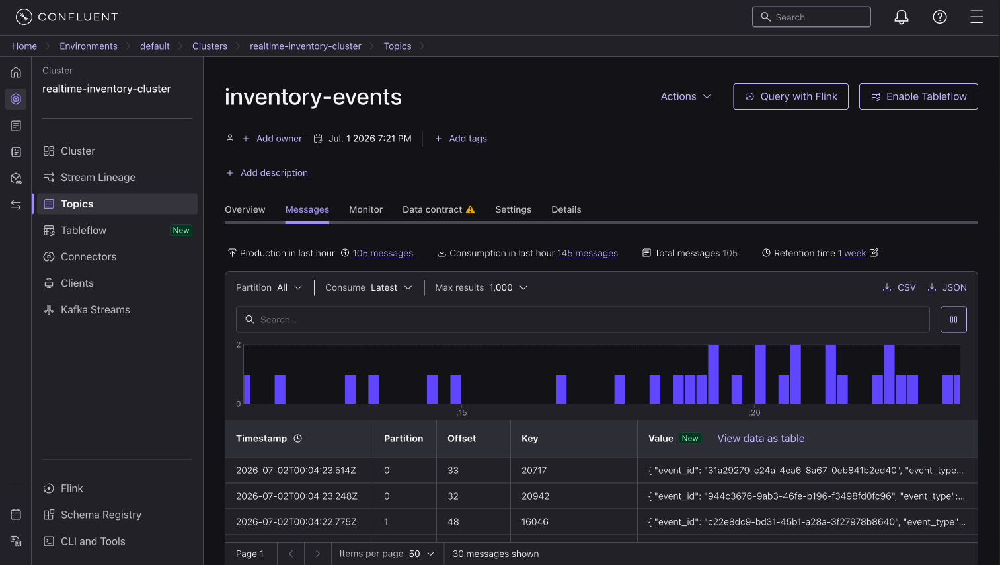
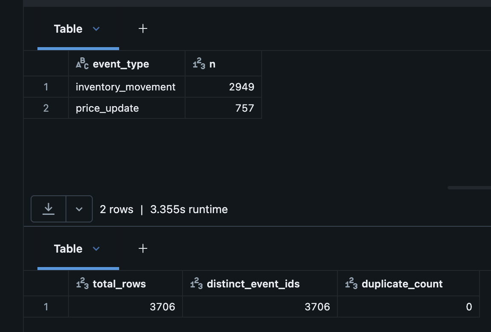

# Real-Time Inventory Lakehouse

Streaming pipeline: Python producer → Kafka (Confluent Cloud) → Spark
Structured Streaming → Delta Lake (Bronze/Silver/Gold) on Databricks.

Dimensions are seeded from the real **Online Retail II** dataset (~1M UK
e-commerce transactions); the event stream is simulated against those real
products and includes deliberately malformed and late arriving events to
exercise the data quality layer.

## Architecture

```
Python event producer (simulated ERP)
        ↓
Kafka — Confluent Cloud  (topic: inventory-events, 3 partitions)
        ↓
Spark Structured Streaming (Databricks)
        ↓
Bronze → Silver → Gold Delta tables
        ↓
dbt tests · Power BI
```

## Event types

| Event              | Share | Purpose                                  |
|--------------------|-------|------------------------------------------|
| inventory_movement | ~70%  | SALE / RESTOCK / RETURN / TRANSFER / ADJUSTMENT |
| price_update       | ~20%  | Drives SCD Type 2 history in dim_product |
| malformed / late   | ~10%  | Missing keys, invalid quantities, 2-hour-late timestamps — caught by the quality layer |

## Progress

- [x] Reference data prep: cleaned Online Retail II → 300 products, 8 warehouses (`producer/prep_reference_data.py`)
- [x] Kafka producer streaming real-product events to Confluent Cloud
- [x] Structured Streaming ingestion → Bronze Delta (exactly once verified: 3706/3706, 0 duplicates)
- [ ] Silver: validation, deduplication, quarantine (in progress)
- [ ] Gold: streaming stock aggregates + SCD Type 2 dim_product
- [ ] Terraform: Azure infra (ADLS, Key Vault, Databricks)
- [ ] dbt tests + freshness alerting
- [ ] CI/CD: GitHub Actions + Databricks Asset Bundles

## Week 1 milestone — Bronze ingestion

Events flow from the producer through Kafka into a Bronze Delta table with
full audit columns (raw payload, Kafka partition/offset, ingestion timestamp).




**Verification:** 3,706 events ingested (2,949 inventory_movement / 757
price_update, the ~10% deliberately malformed events are generated as
mutated inventory movements, so they are counted within that type and are
quarantined in the Silver layer). `count(*) = count(DISTINCT event_id)`
held across multiple restarts, including recovery from a mid run failure.

## Design notes

- **Trigger choice:** Bronze runs with `availableNow` (incremental batch),
  streaming semantics and checkpointed Kafka offsets without an always on
  cluster. Switching to continuous is a one line trigger change; the Gold
  stock aggregate will run continuously where dashboard freshness justifies it.
- **Serverless quirk:** `display()` on a streaming DataFrame shows stream
  metrics rather than rows on serverless compute,validation is done by
  writing to a Delta table and querying it.
- **Exactly once:** guaranteed by the checkpoint (Kafka offsets) plus
  idempotent Delta micro batch writes; verified empirically, including
  after a failed run (Kafka connection config error) resumed cleanly from
  the same checkpoint.
- **Bronze keeps `raw_json`:** the raw payload is preserved so events can
  be reparsed if the schema evolves, Bronze is the replayable source of
  truth inside the lakehouse.
- **Secrets:** Kafka credentials are currently notebook constants;
  migration to Key Vault, backed secret scopes is planned in the Terraform
  phase.

## Repo structure

```
producer/
  prep_reference_data.py   # cleans the Kaggle xlsx → reference CSVs
  producer.py              # streams events to Kafka
  ref_products.csv
  ref_warehouses.csv
databricks/
  01_bronze_ingestion.py   # Kafka → Bronze Delta (availableNow trigger)
docs/
  img/                     # screenshots
```
